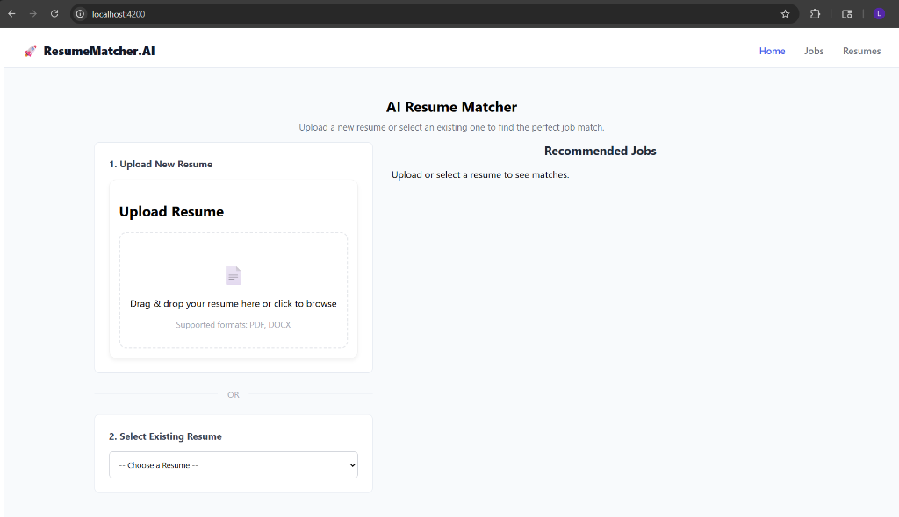
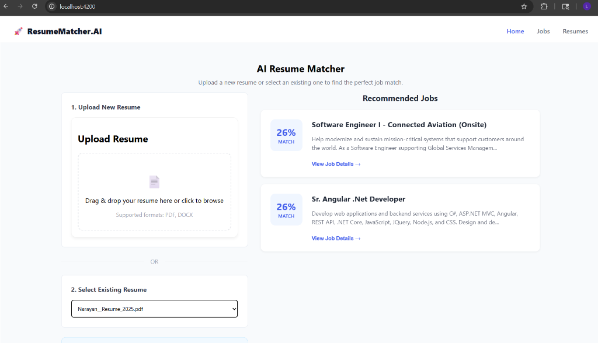
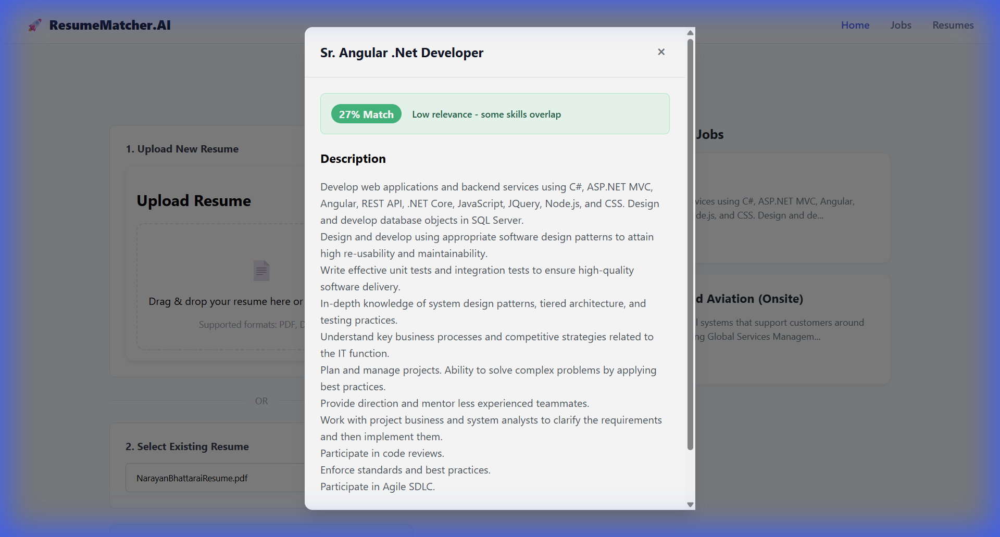

# AI Resume Matcher 🚀

An intelligent AI-powered platform that matches candidates with the perfect job opportunities. This application leverages modern Machine Learning techniques to extract skills from resumes and compute semantic similarity scores against job descriptions using vector embeddings.

## ✨ Features

*   **Resume Parsing & Skill Extraction:** Automatically extracts key information (skills, name, email, phone) from PDF and DOCX resumes using NLP.
*   **AI-Powered Matching:** Uses **Sentence Transformers** to generate semantic embeddings for both resumes and job descriptions.
*   **Intelligent Scoring:** Calculates match percentage based on cosine similarity, prioritizing relevant skills and experience.
*   **Duplicate Detection:** Smartly detects duplicate uploads by filename or content, preventing redundant data while still providing instant matches.
*   **Modern UI:** A clean, responsive dashboard built with Angular, featuring real-time feedback and dynamic animations.
*   **Vector Search:** Efficient similarity search simulated for demonstration (scalable to `pgvector`).

## 📸 Screenshots

### Dashboard
The central hub for managing resumes.


### Recommendations
The "Recommended Jobs" section is dynamically updated based on the selected resume, providing instant feedback.


### Intelligent Job Matching
Clicking on a job card reveals detailed insights, including a precise match score and a relevance breakdown.


## 🛠️ Technology Stack

### Frontend
-   **Framework:** Angular (v17+) using Standalone Components.
-   **Styling:** Modern CSS (Flexbox/Grid), clean aesthetics with responsive design.
-   **State Management:** Reactive services with RxJS.

### Backend
-   **Framework:** Spring Boot 3 (Java).
-   **Database:** PostgreSQL (with JDBC/JPA).
-   **API:** RESTful endpoints for job and resume management.

### ML Service
-   **Framework:** FastAPI (Python).
-   **Models:** `sentence-transformers/all-MiniLM-L6-v2` for generating high-quality text embeddings.
-   **Parsing:** `pdfminer.six` and `python-docx` for robust text extraction.

## 🚀 Getting Started

### Prerequisites
-   Node.js (v18+) & npm
-   Java 17+ & Maven
-   Python 3.9+ & pip
-   PostgreSQL

### 1. Database Setup
Ensure PostgreSQL is running and create a database named `resumematcher`.
```sql
CREATE DATABASE resumematcher;
```

### 2. Backend Setup
Navigate to the backend directory and run the Spring Boot application.
```bash
cd backend
mvn spring-boot:run
```
The backend will start on `http://localhost:8080`.

### 3. ML Service Setup
Navigate to the ml-service directory, create a virtual environment, and install dependencies.
```bash
cd ml-service
python -m venv venv
# Windows
.\venv\Scripts\activate
# Linux/Mac
source venv/bin/activate

pip install -r requirements.txt
uvicorn main:app --reload
```
The ML service will start on `http://localhost:8000`.

### 4. Frontend Setup
Navigate to the frontend directory and start the Angular development server.
```bash
cd frontend
npm install
npm start
```
The application will be available at `http://localhost:4200`.

## 🔄 How It Works

1.  **Upload:** User drags & drops a resume (PDF/DOCX) into the dashboard.
2.  **Extraction:** The Backend sends the file to the ML Service, which extracts text and identifies skills.
3.  **Embedding:** The ML Service converts the resume's text into a 384-dimensional vector embedding.
4.  **Matching:** The Backend stores this vector and compares it against pre-calculated embeddings of available Job Descriptions using cosine similarity.
5.  **Results:** An ordered list of jobs is returned to the Frontend, displaying the "Match Score" to the user.

## 🤝 Contributing

Contributions are welcome! Please feel free to submit a Pull Request.

---
*Built with ❤️ by [Narayan Bhattarai](https://github.com/narayan-bhattarai)*
