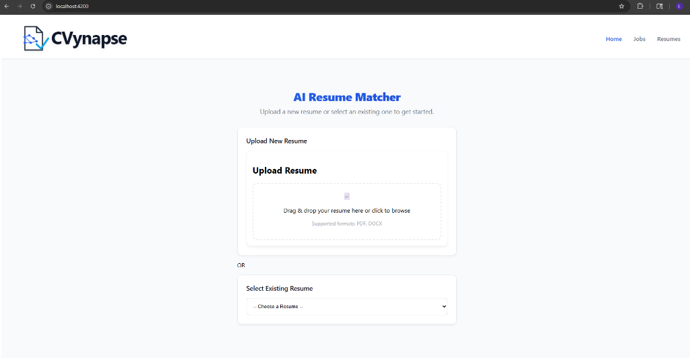
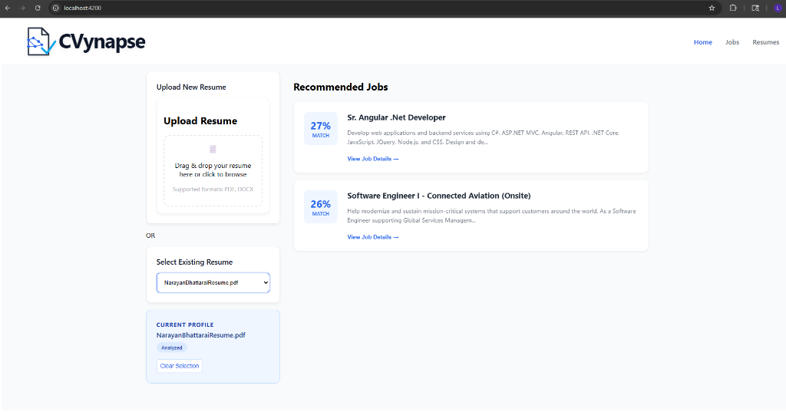
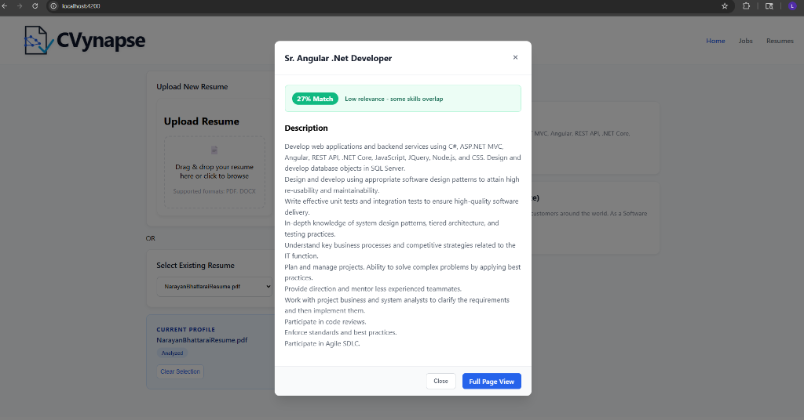

# CVynapse: AI Resume Matcher 🚀

**CVynapse** is an intelligent resume matching platform that helps you find the perfect job candidates instantly. Powered by advanced AI, it analyzes resumes and matches them against job descriptions with precision.

## ✨ Features

*   **Smart Matching:** Uses vector embeddings to semantically match resumes to job descriptions.
*   **Intuitive Dashboard:** A clean, responsive interface for uploading resumes and viewing matches.
*   **Instant Analysis:** Get immediate feedback on candidate relevance with percentage match scores.
*   **Detailed Insights:** View detailed breakdowns of skills overlap and relevance.

## 📸 Screenshots

### 1. Clean & Modern Dashboard
*Upload a new resume or select an existing one to get started.*

### 2. Intelligent Job Recommendations
*Instantly see the best matching jobs for the selected profile.*

### 3. Detailed Match Analysis
*Deep dive into why a candidate is a good fit for a specific role.*

## 🛠️ Tech Stack

*   **Frontend:** Angular 17+
*   **Backend:** Spring Boot (Java)
*   **ML Service:** Python (FastAPI + Hugging Face Transformers)
*   **Database:** PostgreSQL
